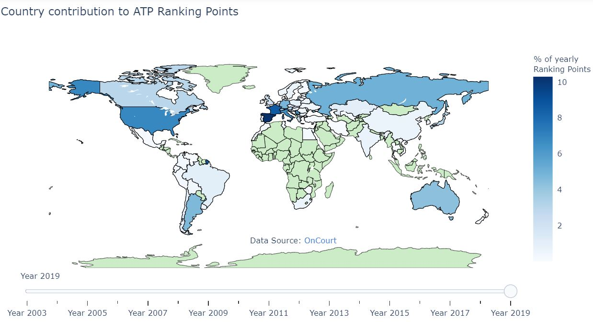

# Visualizing Country Strength in Tennis

On the ATP side of tennis, the growth of Canadian representation at major tournaments has really taken off recently. By the end of the 2019 season Denis Shapovalov (age 20) ranked 15th, Felix Auger-Aliassime (age 19) ranked 21st and Milos Raonic (age 28) ranked 31st. Compared to a decade prior, it'd be common to not see a single Canadian ranked in the top 100 in terms of singles play. The same can be said on the WTA side of tennis, where Canadian Bianca Andreescu (age 19) ranked 5th by the end of the 2019 season, and also brought home Canada's first grand slam champion (US Open). A decade prior, many of the top Canadian tennis players were not recognizable among the world's elite. So how far exactly have we come as a nation competing in Tennis? With some choropleth maps, we help answer this question!

How do we measure country strength in Tennis? We look directly at ranking points. Ranking points are awarded to players who win at big stages of the tennis season. In terms of tournaments, A tennis season can be broken down into Grand Slams, Masters 1000 and Masters 500/250s. The further along a player progresses through a tennis tournament, the more ranking points that player is awarded. For example, a player who wins a grand slam tournament is awarded 2000 points while the runner up is awarded 1200 ranking points. A player who wins a Master 1000 tournament is awarded 1000 points, while the runner up is awarded 600 ranking points.

For each player, the final ranking points of the season is computed as follows: 

Player scores for all 4 grand slam tournaments + Player score for all 8 Masters 1000 + Player's best 6 results from Master's 500/250 tournaments.
For each season, we quantify each country's tennis strength by computing the total ranking points from players originating from the same country divided by the grand total ranking points of the season.

Using player ranking data from Oncourt, I've processed the data to summarize the total relative contributing ranking points from each country. This is done by summing the yearly ranking points for players from each country, and then dividing by the total ranking points distributed for that year. 

## ATP Analysis

Here is a static image from the 2019 season:

The [interactive version](https://plot.ly/~petertea96/21/#/) of this map shows exactly how the nation strength of tennis has shifted through time.

From 2003 – 2019, the ATP world has largely been dominated by Spain and USA. In recent years, Canada seems to be getting better and better!

## WTA Analysis
Here is a static image from the 2019 season:

The [interactive version](https://plot.ly/~petertea96/23/#/) of this map shows exactly how the nation strength of tennis has shifted through time.

From 2003 – 2019, the WTA world has largely been dominated by Russia and USA. 
