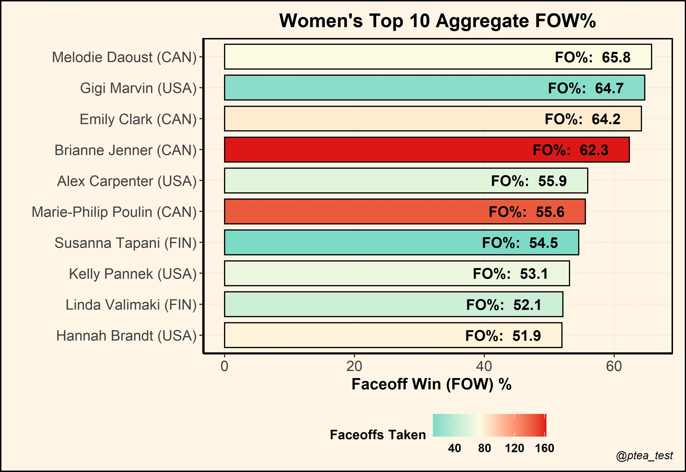
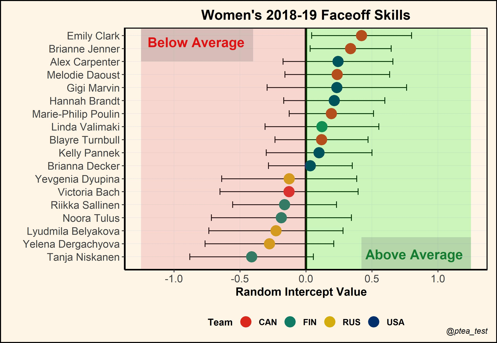
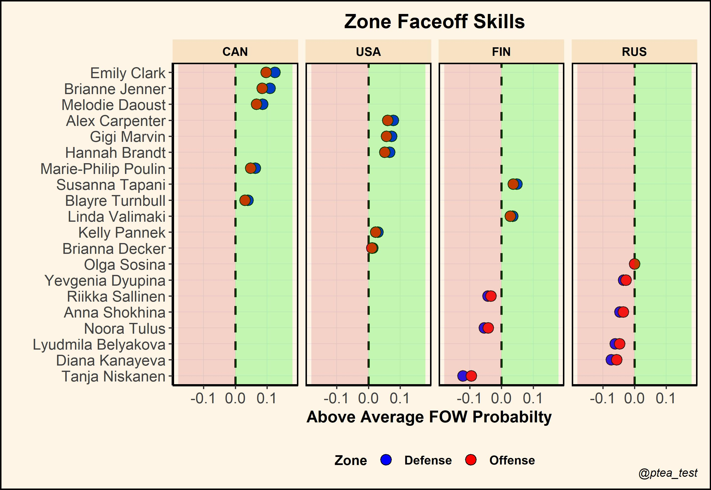

Faceoffs rank among one of the most important responsibilities for centers. Not only does winning draws create scoring opportunities, they are also a catalyst for maintaining possession without having to chase the puck around the rink. Quantifying faceoff skill has still largely defaulted to simple aggregate measures that naïvely assume all faceoffs being equal in magnitude. We introduce a player faceoff model that accounts for contextual information when estimating faceoff skill. 

Often deemed the *game within the game*, fans and broadcasters are most familiar with Faceoff Win (FOW) $\%$ as the de-facto measure of faceoff skill. But, this aggregate measure is overly-simplistic and severely lacks substance; it completely ignores the context underlying each faceoff battle. Consider, for example, the top ten women’s players in FOW $\%$  — with a minimum of 10 draws taken — during the combined 2018 and 2019 national games.

At first glance, we see that FOW $\%$ is extremely sensitive to faceoff opportunities. For instance, while Melodie Daoust comfortably ranks over 3 percentage points above Brianne Jenner in the faceoff dot, Jenner has consistently won more draws under a superior body of work. If Daoust truly were the better faceoff-taker, then   why was Jenner handed extra faceoff responsibilities? 

What these aggregate measures don’t account for are factors like quality of the opponent. We should be more impressed with wins against elite faceoff-takers like Sidney Crosby, and cautious with wins against comparatively weaker competition like Nick Suzuki. Moreover, these aggregates do not account for match context underlying each faceoff. As a solution, we propose a multilevel player faceoff model that account for these factors.

## Player Faceoff Model

Let $Y_{ijk}$  be the binary win-loss faceoff outcome (1 = Win, 0 = Loss) for player $i$ against player $j$ on the $k^{th}$ faceoff. We model our response using a generalized linear mixed model,

$$
\log \left(\frac{\operatorname{Prob}(Y_{ijk}=1 \mid X_{ijk})}{\operatorname{Prob}(Y_{ijk}=0 \mid X_{ijk})}\right)=  \alpha_{i} + \alpha_{j} + X_{ijk}^T   \beta ,
$$

where each random effect is drawn independently from a normal distribution with zero mean and general variance structure.

$\beta$ contains all fixed effects that describe how all players are affected on average by match events. Meanwhile, $\alpha_i$ and $\alpha_j$ are crossed player random intercepts, representing different baseline likelihoods of winning a faceoff — which we will refer to as player faceoff skills. 

The player faceoff model was implemented with the R package $lme4$ using a binomial family for the outcome distribution. Code for model fitting can be found [here](https://github.com/petertea96/stathletes_hockey_hackathon_2021).

## Fixed Effects Results

Fixed effect results can be found in Table 1.

| Fixed Effect               | Odds Ratio  | P-Value |
|----------------------------|-------------|---------|
| Home Player                | 1.21        | 0.13    |
| +1 Teammate / -1 Teammate  | 1.90 / 0.53 | < 0.05  |
| + 2 Teammate / -2 Teammate | 8.87 / 0.11 | < 0.05  |
| Strong Side Faceoff        | 1.27        | < 0.05  |
*Table 1. Odds Ratio estimates and corresponding p-values for the player faceoff model’s fixed effects*

Home ice has a positive effect on winning faceoffs, likely for two main reasons:

1. Home teams have last change, which allows coaches to choose a favourable lineup — and faceoff — matchup.
    
2. Away team skaters must put their stick down first, allowing the home skater to adjust faceoff tactics.

Furthermore, when a player has extra teammates on the ice (eg. while on the powerplay), the extra support can help secure a faceoff win. For the same reasons, shorthanded situations have a negative effect. This effect is stronger with larger disparities of skaters on the ice.^[Note that there were only 11 faceoffs taken on 5-on-3 situations which may have biased our results.]  Lastly, strong side faceoffs, which indicate whether a player’s handedness matches the side of the board she is closest to^[i.e., a right-handed player taking a faceoff on the right side and vice-versa], have a positive effect on winning faceoffs.^[See *Winning Isn’t Everything – A contextual analysis of hockey face-offs.*] 

## Random Effects Results

Below, we plot the predicted random intercepts with corresponding two standard deviation bands for all players who participated in at least 15 draws. Intercept values of 0 represent *average* faceoff skill, while deviations upward or downward represent above or below average skill, respectively.

Comparing players based on their random intercept values, we get a more sensible ranking of faceoff skill. Jenner now ranks 2nd on our list, behind only Emily Clark. Noticeably, Jenner also has a shorter confidence band around her predicted value, owing to her comparatively large faceoff sample size.

With the player faceoff model, we can also obtain head-to-head faceoff predictions under interesting hypothetical situations. For example, suppose that Jenner takes a faceoff against her teammate Daoust. Assuming that Jenner is on the home team, and currently on a 5-on-4 power play, our fitted faceoff model would predict a 70$\%$ win percentage in favour of Jenner.

## Limitations and Further Work

With a limited sample size of 783 faceoffs, there was a weak appetite for a highly parameterized model. While we found some significant effects, we likely did not capture all relevant effects such as player fatigue or head-to-head interactions. 

As presently constructed, we allowed only intercepts to vary across players while all other contextual effects are held fixed. However, more elaborate model schemas can be constructed to view how a player’s probability of winning a faceoff varies in response to the changing situations of a match. For instance, one could consider player-varying effects in the Offensive and Defensive zones. 

In the above plot, faceoff performances in either zone do not vary too greatly. Nonetheless, such plots can be used to inform on the relative faceoff strengths of players under varying match situations.

